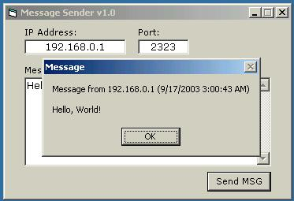



## MsgSender

### Description

This a simple Message Sender, I wrote this coz my friend need this kind of program. Very simple and basic, fully commented so its easy to understand. If you find any bugs please report or if you have some questions, suggestions or comments, please email me. The concept of this program is to avoid permanent connections, so if the client send a message, the host get it and disconnect the client immediately. If you may find this usefull, then thanx... good luck to you all and God Bless.
 
### More Info
 

             |
---                |---
**Submitted On**   |2003-09-16 15:08:02
**By**             |[Vanni Alora](https://github.com/Planet-Source-Code/PSCIndex/blob/master/ByAuthor/vanni-alora.md)
**Level**          |Beginner
**User Rating**    |4.8 (19 globes from 4 users)
**Compatibility**  |VB 6\.0
**Category**       |[Internet/ HTML](https://github.com/Planet-Source-Code/PSCIndex/blob/master/ByCategory/internet-html__1-34.md)
**World**          |[Visual Basic](https://github.com/Planet-Source-Code/PSCIndex/blob/master/ByWorld/visual-basic.md)
**Archive File**   |[MsgSender1646169162003\.zip](https://github.com/Planet-Source-Code/vanni-alora-msgsender__1-48555/archive/master.zip)

